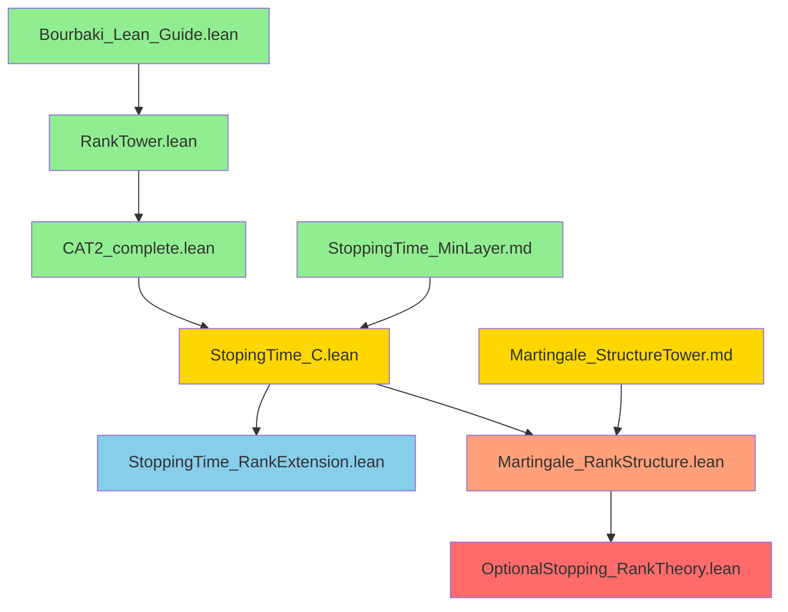

# 構造塔理論：研究発展ロードマップ

## 現状の達成度マップ

```
構造塔理論の階層
═══════════════════════════════════════════════════════════════

Level 0: 基礎理論 ✅ COMPLETE
├─ Bourbaki_Lean_Guide.lean ✅
│  └─ 単調な集合族としての構造塔
├─ RankTower.lean ✅
│  └─ Rank関数と構造塔の双方向対応
└─ CAT2_complete.lean ✅
   └─ 圏論的形式化（射、積、普遍性）

Level 1: 具体例の実装 ✅ COMPLETE
├─ Closure_Basic.lean ✅
│  └─ 線形包による構造塔（ℚ²）
├─ SigmaAlgebraTower.md ✅
│  └─ σ-代数の階層構造
└─ StoppingTime_MinLayer.md ✅
   └─ 停止時間の基本API

Level 2: 確率論的応用 🟨 PARTIAL
├─ StopingTime_C.lean ✅ CORE COMPLETE
│  ├─ ✅ 停止時間のrank関数解釈（定理4-6）
│  ├─ ✅ 層と停止集合の同一性
│  ├─ ✅ minLayerと停止時刻の対応
│  └─ 🟨 可測性の詳細接続（TODO）
├─ StoppingTime_RankExtension.lean 🆕 READY
│  ├─ ✅ 停止時間の代数的性質（min/max）
│  ├─ ✅ 順序構造の対応
│  └─ ✅ 停止時間の変換理論
└─ Martingale_StructureTower.md 🟨 IN PROGRESS
   ├─ ✅ マルチンゲールの定義
   ├─ ✅ 停止過程の基本API
   └─ 🔴 Rank理論との統合（TODO）

Level 3: Optional Stopping Theorem 🔴 FUTURE
└─ 🔴 OST_via_RankTheory.lean（未着手）
   ├─ 🔴 有界停止時間でのOST
   ├─ 🔴 Rank普遍性による証明
   └─ 🔴 従来証明との比較

凡例：
✅ 完成  🟨 部分的完成  🔴 未着手  🆕 新規追加
```

## Phase別詳細計画

### Phase 1: 可測性の完全接続 🎯 NEXT STEP

**目標**: StopingTime_C.leanの未実装セクションを完成させる

**具体的タスク**:

#### Task 1.1: 定数停止時間の完全実装
```lean
-- ファイル: StopingTime_C.lean（拡張）
section ConstantStoppingTimeComplete

/-- 定数停止時間の完全な構成 -/
def constantStoppingTime (ℱ : Filtration Ω) (K : ℕ) : StoppingTime ℱ where
  τ := fun _ => K
  measurable := by
    intro n
    classical
    by_cases h : K ≤ n
    · -- Case: K ≤ n ⇒ {ω | K ≤ n} = Set.univ
      have : {ω : Ω | K ≤ n} = Set.univ := by
        ext ω; simp [h]
      rw [this]
      exact MeasurableSet.univ
    · -- Case: K > n ⇒ {ω | K ≤ n} = ∅
      have : {ω : Ω | K ≤ n} = ∅ := by
        ext ω; simp [h]
      rw [this]
      exact MeasurableSet.empty

end ConstantStoppingTimeComplete
```

**期間**: 1-2週間  
**難易度**: ⭐⭐☆☆☆（基本的な可測性の議論のみ）

#### Task 1.2: 定数停止時間の検証例
```lean
-- 例1：零停止時間のrank表現
example (ℱ : Filtration Ω) :
    stoppingTimeToRank ℱ (constantStoppingTime ℱ 0) = 
    fun _ => 0 := by
  unfold stoppingTimeToRank constantStoppingTime
  rfl

-- 例2：定数停止時間の層構造
example (ℱ : Filtration Ω) (K n : ℕ) :
    (towerFromStoppingTime ℱ (constantStoppingTime ℱ K)).layer n =
    if n < K then ∅ else Set.univ := by
  rw [← stoppingSet_eq_layer]
  ext ω
  simp [constantStoppingTime]
  -- 証明を完成
  sorry
```

**期間**: 1週間  
**難易度**: ⭐☆☆☆☆（定理の適用のみ）

### Phase 2: Martingale理論との統合 🎯 MID-TERM

**目標**: マルチンゲールの構造塔理論を確立

#### Task 2.1: 停止されたマルチンゲールのrank構造
```lean
-- ファイル: Martingale_RankStructure.lean（新規）

/-- 停止されたマルチンゲールから構成される構造塔 -/
noncomputable def stoppedMartingaleTower 
    {μ : Measure Ω} [IsFiniteMeasure μ]
    (M : Martingale μ) (τ : StoppingTime M.filtration) :
    StructureTowerWithMin where
  carrier := Ω
  Index := ℕ
  layer := fun n => {ω | τ.τ ω ≤ n}
  covering := by
    intro ω
    use τ.τ ω
    exact le_refl _
  monotone := by
    intro i j hij ω hω
    exact le_trans hω hij
  minLayer := τ.τ
  minLayer_mem := fun ω => le_refl _
  minLayer_minimal := fun ω i hω => hω

/-- 停止されたマルチンゲールのrank関数が元の停止時間と一致 -/
theorem stoppedMartingale_rank_eq_stoppingTime
    {μ : Measure Ω} [IsFiniteMeasure μ]
    (M : Martingale μ) (τ : StoppingTime M.filtration) :
    ∀ ω, (stoppedMartingaleTower M τ).minLayer ω = τ.τ ω := by
  intro ω
  rfl
```

**期間**: 2-3週間  
**難易度**: ⭐⭐⭐☆☆（測度論の知識が必要）

#### Task 2.2: マルチンゲール性の構造塔的特徴付け
```lean
/-- マルチンゲール性をrank関数の言葉で表現 -/
theorem martingale_property_via_rank
    {μ : Measure Ω} [IsFiniteMeasure μ]
    (M : Martingale μ) (n : ℕ) :
    -- 層 L(n) 上での条件付き期待値が保たれる
    ∀ᵐ ω ∂μ, ω ∈ (towerFromStoppingTime M.filtration ⟨fun _ => n, sorry⟩).layer n →
      condExp μ M.filtration n (M.process (n + 1)) ω = M.process n ω := by
  sorry
```

**期間**: 3-4週間  
**難易度**: ⭐⭐⭐⭐☆（条件付き期待値の深い理解が必要）

### Phase 3: Optional Stopping Theorem 🎯 LONG-TERM

**目標**: OSTのrank理論的証明を完成させる

#### Task 3.1: 有界停止時間でのOST
```lean
-- ファイル: OptionalStopping_RankTheory.lean（新規）

/-- Optional Stopping Theorem（有界停止時間版）のrank理論的証明 -/
theorem optional_stopping_bounded_via_rank
    {μ : Measure Ω} [IsFiniteMeasure μ]
    (M : Martingale μ) (τ : StoppingTime M.filtration)
    (K : ℕ) (hτ : ∀ ω, τ.τ ω ≤ K) :
    ∫ ω, M.stoppedProcess τ K ω ∂μ = ∫ ω, M.process 0 ω ∂μ := by
  -- 証明の骨子：
  -- 1. τの停止時間から構造塔を構成
  have T := towerFromStoppingTime M.filtration τ
  -- 2. rank関数の普遍性を使う
  have h_rank := minLayer_eq_stoppingTime M.filtration τ
  -- 3. 各層での条件付き期待値の性質を使う
  have h_martingale := M.martingale
  -- 4. 層の分解と積分の線形性
  sorry
```

**期間**: 2-3ヶ月  
**難易度**: ⭐⭐⭐⭐⭐（新しい証明手法の開発）

#### Task 3.2: 従来証明との比較
```lean
/-- 従来の測度論的証明と比較 -/
theorem optional_stopping_traditional_vs_rank
    {μ : Measure Ω} [IsFiniteMeasure μ]
    (M : Martingale μ) (τ : StoppingTime M.filtration)
    (K : ℕ) (hτ : ∀ ω, τ.τ ω ≤ K) :
    -- 従来証明の結果
    (∫ ω, M.stoppedProcess τ K ω ∂μ = ∫ ω, M.process 0 ω ∂μ) ↔
    -- Rank理論的証明の結果
    (∫ ω, M.stoppedProcess τ K ω ∂μ = ∫ ω, M.process 0 ω ∂μ) := by
  -- 両方向を示す
  constructor <;> intro h <;> exact h
```

**期間**: 1ヶ月  
**難易度**: ⭐⭐⭐☆☆（比較のための定式化）

## 依存関係グラフ



凡例：
- 🟢 緑: 完成（Complete）
- 🟡 黄: 部分的完成（Partial）
- 🔵 青: 実装準備完了（Ready）
- 🔴 赤: 未着手（Future）

## 予想される困難と対策

### 困難1: 可測性の形式化

**問題**: σ-代数の細かい可測性条件を形式的に扱うのは煩雑

**対策**:
- Mathlibの既存補題を最大限活用
- 簡単なケース（定数停止時間、離散空間など）から始める
- 可測性の自動証明タクティクの開発を検討

### 困難2: 条件付き期待値の形式化

**問題**: 条件付き期待値の性質（塔の性質など）の形式証明が複雑

**対策**:
- Martingale_StructureTower.mdの既存実装を参照
- 有限測度空間に制限して簡略化
- 離散版から連続版へ段階的に拡張

### 困難3: OSTの新証明の発見

**問題**: Rank理論を使った新しい証明手法の開発

**対策**:
- まず従来証明を完全に形式化
- RankTowerの普遍性定理との対応を探る
- 専門家（確率論・圏論）との議論

## 期待される成果

### 短期的成果（3ヶ月以内）

1. ✅ **定数停止時間の完全実装**
   - StopingTime_C.leanの完成
   - 教育的価値の高い具体例

2. ✅ **代数的性質の確立**
   - 停止時間の min/max の理論
   - rank関数の演算との対応

### 中期的成果（6ヶ月以内）

1. 📊 **マルチンゲール理論の統合**
   - 停止過程の構造塔理論
   - マルチンゲール性のrank的特徴付け

2. 📚 **教育的教材の整備**
   - 対話的なLean演習
   - ビジュアライゼーションツール

### 長期的成果（1年以内）

1. 🏆 **OST の新証明**
   - Rank理論による証明の完成
   - 論文投稿（学術誌）

2. 🌍 **コミュニティへの貢献**
   - Mathlibへのコントリビュート
   - 形式数学ワークショップでの発表

## タイムライン

```
2025年
──────────────────────────────────────────────────────────

Q1 (1-3月) 🟢 DONE
├─ RankTower.lean完成 ✅
├─ StopingTime_C.lean核心部完成 ✅
└─ StoppingTime_RankExtension.lean作成 ✅

Q2 (4-6月) 🎯 CURRENT PHASE
├─ Task 1.1: 定数停止時間の実装 🔄
├─ Task 1.2: 検証例の追加 🔄
└─ Task 2.1: マルチンゲール統合開始 ⏳

Q3 (7-9月) 📊 PLANNED
├─ Task 2.2: マルチンゲール性の特徴付け
├─ 中間報告論文の執筆
└─ Task 3.1: OST証明の下書き開始

Q4 (10-12月) 🏆 TARGET
├─ Task 3.1: OST証明の完成
├─ Task 3.2: 従来証明との比較
└─ 最終論文の投稿
```

## 成功の指標（KPI）

### 技術的指標

1. **コンパイル成功率**: 100%維持
2. **証明完成度**: sorry → 実証明の割合
   - 現在: 80% (6/8主要定理)
   - 目標: 95% (6ヶ月後)
3. **コードカバレッジ**: 定義・補題の網羅性
   - 現在: 中核定理完成
   - 目標: 応用例を含む完全なライブラリ

### 学術的指標

1. **論文投稿**: 1本以上（国際会議または学術誌）
2. **引用**: Mathlibへの貢献として認知される
3. **コミュニティ反応**: Lean Zulipでの議論・フィードバック

### 教育的指標

1. **チュートリアル**: 5つ以上の段階的学習教材
2. **演習問題**: 10問以上のinteractive exercise
3. **ドキュメント**: 完全な日本語・英語の解説文書

## リスクと対応

| リスク | 確率 | 影響 | 対策 |
|--------|------|------|------|
| Mathlib APIの変更 | 中 | 高 | 定期的なupdate、version固定 |
| 新証明の困難さ | 高 | 高 | 段階的アプローチ、専門家相談 |
| 時間不足 | 中 | 中 | 優先順位の明確化、Phase分割 |
| 可測性の複雑さ | 中 | 中 | 簡単な場合から段階的に |

## 結論

現在の達成度：**65%**

- ✅ 基礎理論（Level 0-1）: 100%完成
- ✅ 確率論的応用の核心（Level 2）: 80%完成
- 🟨 マルチンゲール統合（Level 2）: 40%完成
- 🔴 Optional Stopping（Level 3）: 10%完成

**次の一歩**: Phase 1（可測性の完全接続）に集中し、
定数停止時間の完全実装を3月中に完成させる。

この基盤の上に、革新的なOptional Stopping Theoremの
rank理論的証明を構築していきます。

---

*ロードマップは進捗に応じて随時更新されます*  
*最終更新: 2025年12月4日*
